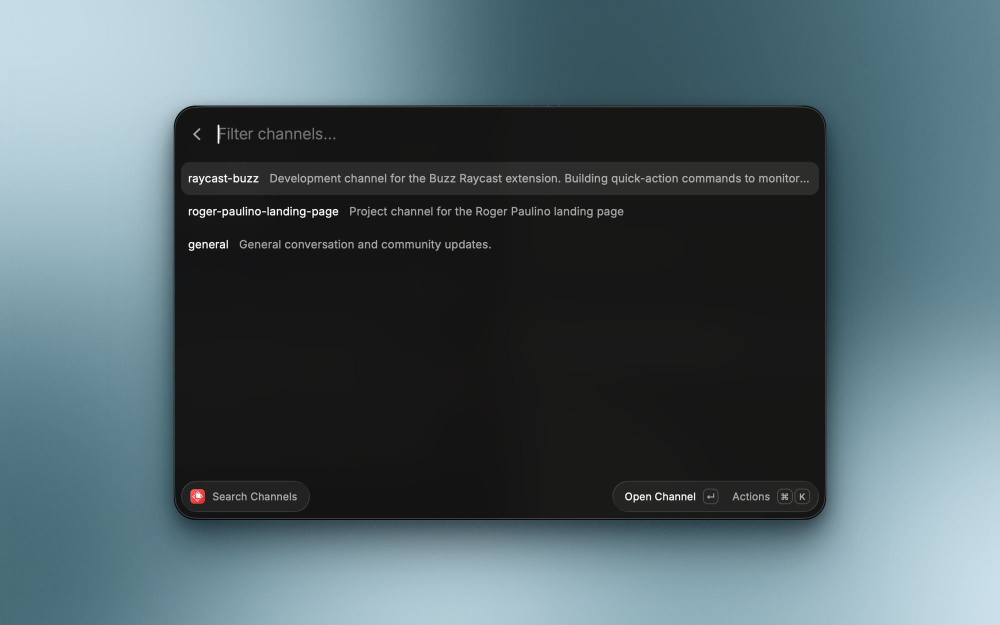

# Buzz for Raycast


Browse channels, search messages, post, react, and set your status in [Buzz](https://buzz.xyz/) directly from your command bar.



Buzz is a self-hostable workspace where humans and agents build together, on a relay you own. It is architecturally a Nostr relay, so every action is a cryptographically signed event. This extension signs each request locally and talks to your relay over its authenticated HTTP bridge, so it needs no CLI or other binary installed.

## Features

- Browse every channel on your relay and drill into its recent messages
- Full-text search across the channels you can access
- Open a message or a channel straight in the Buzz app
- Post a message to any channel without leaving Raycast
- React to a message with a NIP-25 like
- Set your user status from a list of reusable presets, or type a custom one, with an optional emoji
- Requests signed locally with NIP-98; your private key never leaves your machine

## Commands

| Command           | Description                                                                       |
| ----------------- | --------------------------------------------------------------------------------- |
| `Search Channels` | Open a channel in Buzz, drill into its messages to read and react, or copy its id |
| `Search Messages` | Full-text search across the channels you can access, and open a hit in Buzz       |
| `Send Message`    | Post a message to a channel you pick from a dropdown                              |
| `Set Status`      | View your current status, apply or manage reusable presets, or set a custom one   |

## Setup

You need a Buzz relay you can reach and a Nostr private key authorized on it. Both are configured once, in the extension's preferences.

| Preference    | Value                                                                                             |
| ------------- | ------------------------------------------------------------------------------------------------- |
| `Relay URL`   | Your relay's base URL, e.g. `https://relay.example.com`. A `wss://` URL is accepted and converted |
| `Private Key` | Your Nostr secret key, either `nsec1...` or 64-character hex. Same value as `BUZZ_PRIVATE_KEY`    |

If either is missing or malformed, every command says so and offers a shortcut straight to the preferences screen.

## About your private key

Your key is stored by Raycast as a password preference and is never transmitted anywhere except as a signature.

- The extension signs each request locally (NIP-98) and sends only the resulting signature. The key itself never leaves your machine.
- No error message produced by the extension includes your key or the body of a request, so a toast or a copied error cannot leak it.
- There is no telemetry and no third-party service. The only host contacted is the relay URL you configure.

## Requirements and limits

This version speaks to the relay over HTTP only, which covers everything the commands above need. The following require an authenticated WebSocket connection (NIP-42) and are not available yet:

- Direct messages, which additionally need NIP-17 gift-wrap encryption
- Presence, which the relay accepts only over WebSocket
- A live or menu bar feed, and unread tracking

## Getting Started

```bash
git clone https://github.com/caasols/raycast-buzz.git
cd raycast-buzz
npm install
npm run dev
```

Other useful scripts:

```bash
npm test               # unit and component tests
npm run test:coverage  # the same, with a coverage report
npm run typecheck      # extension and test projects
npm run lint
npm run build
```

There is also an end-to-end smoke test that runs against a real relay. It lists channels, posts a marker message, reads it back, reacts to it, and round-trips a status (with an emoji) through set/get/clear, so point it at a workspace where that is acceptable:

```bash
BUZZ_RELAY_URL=https://relay.example.com BUZZ_PRIVATE_KEY=nsec1... npm run smoke
```

## Contributing

Issues and pull requests are welcome. Please open a discussion if you plan to work on a larger change so we can align on the approach.

## Support

If this extension saves you time:

- Star the [GitHub repository](https://github.com/caasols/raycast-buzz)
- Share it with coworkers who live in their command bar
- Report bugs or enhancements via GitHub issues

## License

Released under the [MIT License](./LICENSE).
